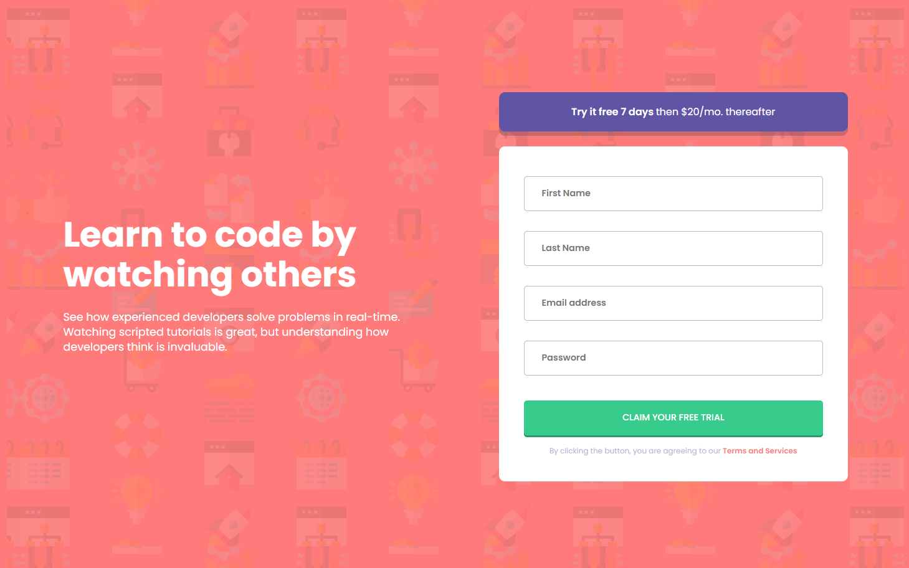

# Frontend Mentor - Intro component with sign up form solution

This is a solution to the [Intro component with sign up form challenge on Frontend Mentor](https://www.frontendmentor.io/challenges/intro-component-with-signup-form-5cf91bd49edda32581d28fd1). Frontend Mentor challenges help you improve your coding skills by building realistic projects. 

## Table of contents

- [Overview](#overview)
  - [The challenge](#the-challenge)
  - [Screenshot](#screenshot)
  - [Links](#links)
- [My process](#my-process)
  - [Built with](#built-with)
- [Author](#author)
- [Acknowledgments](#acknowledgments)

## Overview

### The challenge

Users should be able to:

- View the optimal layout for the site depending on their device's screen size
- See hover states for all interactive elements on the page
- Receive an error message when the `form` is submitted if:
  - Any `input` field is empty. The message for this error should say *"[Field Name] cannot be empty"*
  - The email address is not formatted correctly (i.e. a correct email address should have this structure: `name@host.tld`). The message for this error should say *"Looks like this is not an email"*

### Screenshot

### Links

- Solution URL: [ solution URL ](https://your-solution-url.com)
- Live Site URL: [ live site URL ](https://otavio-cipriano.github.io/intro-with-signup-form/)

## My process

### Built with

- Semantic HTML5 markup
- CSS custom properties
- Flexbox
- CSS Grid
- Mobile-first workflow
- [SASS](https://sass-lang.com/) - CSS extension
- [Parcel](https://parceljs.org) - Javascript bundler/compiler
- [Bem](http://getbem.com/) - CSS naming convention

### Useful resources

- [GetBem, Bem Documentation](http://getbem.com/introduction/) - This helped me for understand better how bem works
- [Sass, Documentation](https://sass-lang.com/) - This is the documentation to SASS he helped me for understand what i could do and what i shouldn't do
- [Parcel, Documentation](https://parceljs.org) - This is the documentation to Parcel, it helped to learn how to start

## Author

- Frontend Mentor - [@Otavio-Cipriano](https://www.frontendmentor.io/profile/Otavio-Cipriano)
- Twitter - [@OtavioDv](https://www.twitter.com/OtavioDv)
- Github - [@Otavio-Cipriano](https://github.com/Otavio-Cipriano/)

